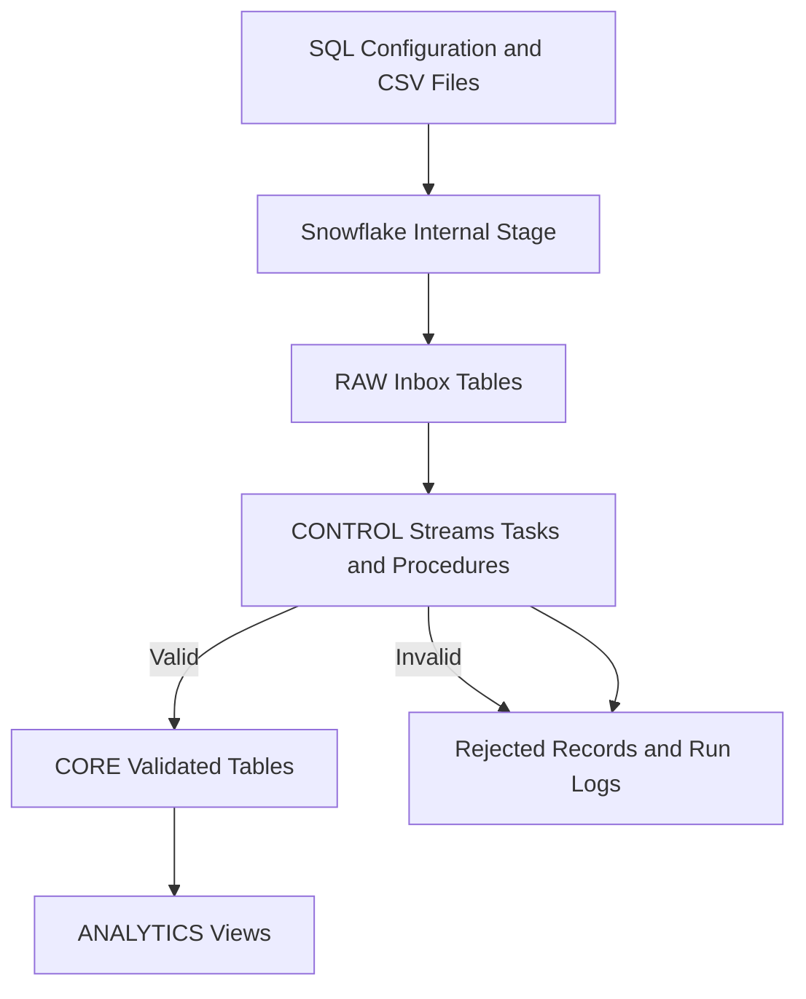

# Snowflake Certification Enablement Platform

## Design Document

**Owner:** Amritha Kalyanasundaram Ganesh

**Version:** 1.0

**Status:** Prototype completed and tested

**Last Updated:** 24 September 2026

## Purpose and Scope

This document describes the design of the Snowflake Certification Enablement Platform.

The platform provides structured learning paths for Snowflake certifications. It registers learners, assigns a learning path based on Snowflake experience, creates a learning schedule, processes study activities, tracks progress, validates incoming data and provides analytics.

The current prototype supports SnowPro Core. The design can be extended to support additional Snowflake certifications in the future.

### In Scope

- Initial Snowflake environment configuration
- SnowPro Core certification configuration
- Exam domains and study topics
- Experience-based learning paths
- Learner-information CSV ingestion
- Learner-progress CSV ingestion
- Learning schedule generation
- Data validation
- Rejected-record handling
- Correction and reprocessing
- Pipeline execution logging
- Stream and Task-based processing
- Progress and assessment tracking
- Analytics views
- Role-based access control
- Git-based version control
- Functional and automation testing

### Outside the Current Scope

- Direct integration with the Mastech Excel source
- Automated email or Teams notifications
- Streamlit user interface
- Enterprise identity integration
- Production deployment
- Support for multiple certifications through configuration

These items are included in the future roadmap.

## Assumptions

- SnowPro Core is the first certification supported by the prototype.
- Initial platform objects and reference data are created through SQL scripts.
- Learner and progress data are currently provided through CSV files.
- CSV files are uploaded to a Snowflake internal stage.
- Only fictional demonstration data is stored in Git.
- Real employee information must be handled through an approved and secure source.
- The prototype uses an X-Small Snowflake warehouse.
- Scheduled Tasks are suspended when they are not being tested or demonstrated.
- Experience categories and learning-path durations are internal prototype recommendations.
- The readiness calculation is an internal indicator and does not guarantee exam success.

## Design Principles

- **Configuration over hardcoding:** Certification topics, learning paths and durations should become configurable.
- **Separation of concerns:** RAW stores incoming data, CORE stores validated data, CONTROL manages processing and ANALYTICS provides reporting.
- **Data quality:** Records are validated before trusted business tables are updated.
- **Auditability:** Pipeline executions, accepted records and rejected records are tracked.
- **Repeatability:** Reprocessing should not create duplicate learners, enrollments or activities.
- **Security:** Snowflake roles provide separate access for learners, managers and administrators.
- **Cost control:** The platform uses an X-Small warehouse and auto-suspend.
- **Version control:** SQL, CSV templates, tests and documents are maintained in Git.

## Platform Capabilities

The platform currently supports:

- Certification and domain configuration
- Study-topic management
- Multiple experience levels
- Experience-based path assignment
- Weekly learning schedules
- Learner registration
- Learner enrollment
- Topic-progress initialization
- Learning-activity recording
- Completion and study-hour tracking
- Assessment-result storage
- Invalid-record rejection
- Corrected-record reprocessing
- Duplicate-source prevention
- Pipeline run logging
- Automated Stream and Task processing
- Progress and readiness analytics
- Role-based access control

## Architecture Overview



## Snowflake Environment

| Component | Name | Purpose |
|---|---|---|
| Warehouse | `SNOWPRO_LEARNING_WH` | Executes platform SQL and pipeline processing |
| Database | `SNOWPRO_ENABLEMENT` | Stores all platform objects |
| RAW schema | `RAW` | Stores incoming data before validation |
| CORE schema | `CORE` | Stores validated platform data |
| CONTROL schema | `CONTROL` | Stores procedures, Tasks, audit data and rejected records |
| ANALYTICS schema | `ANALYTICS` | Stores reporting and progress views |

The technical database and warehouse names come from the initial SnowPro Core prototype. The user-facing project name is Snowflake Certification Enablement Platform.

## Data Layers

### RAW Layer

The RAW layer stores newly loaded data before business validation.

Main objects include:

- `RAW.STUDY_TOPICS_INBOX`
- `RAW.LEARNER_INFORMATION_INBOX`
- `RAW.LEARNER_PROGRESS_INBOX`
- `RAW.STUDY_TOPICS_STREAM`
- `RAW.LEARNER_INFORMATION_STREAM`
- `RAW.LEARNER_PROGRESS_STREAM`
- `RAW.CERTIFICATION_UPLOAD_STAGE`
- `RAW.CERTIFICATION_CSV_FORMAT`

RAW learner and progress values are stored as text where appropriate. This allows invalid values to be loaded and evaluated by the validation procedure instead of causing the complete CSV load to fail.

### CORE Layer

The CORE layer stores validated and trusted platform data.

Main objects include:

- `CORE.CERTIFICATIONS`
- `CORE.EXAM_DOMAINS`
- `CORE.STUDY_TOPICS`
- `CORE.EXPERIENCE_LEVELS`
- `CORE.LEARNING_PATHS`
- `CORE.PATH_TOPIC_PLAN`
- `CORE.LEARNERS`
- `CORE.ENROLLMENTS`
- `CORE.TOPIC_PROGRESS`
- `CORE.LEARNING_EVENTS`
- `CORE.ASSESSMENT_RESULTS`

### CONTROL Layer

The CONTROL layer manages validation, processing, scheduling and observability.

Main objects include:

- `CONTROL.REGISTER_LEARNER`
- `CONTROL.PROCESS_STUDY_TOPICS`
- `CONTROL.RECORD_LEARNING_ACTIVITY`
- `CONTROL.PROCESS_LEARNING_EVENTS`
- `CONTROL.PROCESS_LEARNER_INFORMATION`
- `CONTROL.PROCESS_LEARNER_PROGRESS`
- `CONTROL.REJECTED_RECORDS`
- `CONTROL.PIPELINE_RUN_LOG`
- `CONTROL.CSV_REJECTED_RECORDS`
- `CONTROL.CSV_PIPELINE_RUN_LOG`
- `CONTROL.CSV_PROCESSED_RECORDS`

### ANALYTICS Layer

The ANALYTICS layer provides reporting-ready information.

Main views include:

- `ANALYTICS.V_WEEKLY_STUDY_PLAN`
- `ANALYTICS.V_LEARNER_PROGRESS`
- `ANALYTICS.V_DOMAIN_PROGRESS`
- `ANALYTICS.V_CERTIFICATION_READINESS`

## Learning Paths

The prototype contains four learning paths.

| Snowflake experience | Experience code | Learning path | Duration | Weekly study target |
|---|---|---|---:|---:|
| Fresher | `FRESHER` | `PATH_FRESHER` | 12 weeks | 8 hours |
| More than 0 and up to 5 years | `EXP_0_5` | `PATH_0_5` | 10 weeks | 7 hours |
| More than 5 and up to 9 years | `EXP_5_9` | `PATH_5_9` | 8 weeks | 6 hours |
| More than 9 years | `EXP_9_PLUS` | `PATH_9_PLUS` | 6 weeks | 5 hours |

Each path contains the same 31 study topics. The topics are distributed across a different number of weeks based on the learner's Snowflake experience.

These timelines are internal prototype recommendations and require review before production use.

## Workflow 1 Initial Configuration

Initial configuration prepares the platform before learner data is processed.

1. Create the X-Small warehouse.
2. Create the database and schemas.
3. Create certification reference tables.
4. Create learner and progress-tracking tables.
5. Load certification, exam-domain and experience-level data.
6. Load the 31 study topics.
7. Create the four learning paths.
8. Generate the path-to-topic schedule.
9. Create processing procedures, Streams and Tasks.
10. Create analytics views.
11. Create RBAC roles.
12. Execute platform data-quality checks.

Initial technical configuration is maintained through version-controlled SQL scripts.

## Workflow 2 Study Topic Ingestion

Study topics are loaded from a CSV file into the RAW layer.

The flow is:

```text
study_topics.csv
→ Internal stage
→ RAW.STUDY_TOPICS_INBOX
→ RAW.STUDY_TOPICS_STREAM
→ CONTROL.PROCESS_STUDY_TOPICS
→ Validation
→ CORE.STUDY_TOPICS or rejected-record table
→ Pipeline run log
```

The procedure validates:

- Topic ID format
- Domain ID format
- Domain existence
- Topic name
- Difficulty level
- Estimated study hours
- Topic order
- Duplicate records

Valid records are merged into `CORE.STUDY_TOPICS`.

Invalid records are stored with a rejection reason.

## Workflow 3 Learner Information Upload

Learner information is supplied through:

```text
data/learner_information.csv
```

### Required Fields

- Source record ID
- Employee ID
- Learner name
- Email
- Department
- Snowflake experience in years

### Processing Flow

```text
Learner CSV
→ Internal stage
→ COPY INTO
→ RAW.LEARNER_INFORMATION_INBOX
→ Stream
→ Learner-processing Task
→ CONTROL.PROCESS_LEARNER_INFORMATION
→ Validation
→ CONTROL.REGISTER_LEARNER
→ CORE learner and enrollment tables
```

The procedure performs the following actions:

1. Reads newly inserted RAW records through the Stream.
2. Validates mandatory fields.
3. Validates the email format.
4. Confirms that Snowflake experience is numeric and non-negative.
5. Checks for repeated source record IDs.
6. Calls the existing learner-registration procedure.
7. Generates consistent learner and enrollment IDs.
8. Assigns the correct experience level.
9. Assigns the corresponding learning path.
10. Calculates target completion and exam dates.
11. Initializes all 31 topic-progress records.
12. Records the successful source ID.
13. Writes the pipeline result to the run log.

Reprocessing an existing employee updates the learner without creating a duplicate learner or enrollment.

## Workflow 4 Learner Progress Upload

Learner progress is supplied through:

```text
data/learner_progress.csv
```

### Required Fields

- Activity ID
- Employee ID
- Topic ID
- Event type
- Duration in minutes
- Completion percentage
- Activity timestamp
- Notes

### Supported Event Types

- `STARTED`
- `STUDIED`
- `COMPLETED`

### Processing Flow

```text
Progress CSV
→ Internal stage
→ COPY INTO
→ RAW.LEARNER_PROGRESS_INBOX
→ Stream
→ Progress-processing Task
→ CONTROL.PROCESS_LEARNER_PROGRESS
→ CORE.LEARNING_EVENTS
→ Learning-events Stream
→ Learning-events Task
→ CORE.TOPIC_PROGRESS
```

The procedure validates:

- Activity ID
- Employee ID
- Active learner enrollment
- Topic assignment
- Event type
- Duration
- Completion percentage
- Activity timestamp
- Duplicate activity ID

Valid activity records are inserted into `CORE.LEARNING_EVENTS`.

The existing learning-events pipeline updates:

- Progress status
- Completion percentage
- Hours spent
- Started timestamp
- Completed timestamp
- Last-activity timestamp

## Invalid Record Workflow

Invalid data does not update the trusted CORE tables.

The error-handling flow is:

```text
Invalid CSV record
→ RAW inbox
→ Validation failure
→ CONTROL.CSV_REJECTED_RECORDS
→ Rejection reason reviewed
→ Source value corrected
→ Corrected CSV uploaded
→ Record processed successfully
→ Rejection marked resolved
```

The demonstration includes two intentional errors:

### Invalid Learner

```text
Snowflake experience = -2
```

Rejection reason:

```text
Snowflake experience must be zero or greater.
```

### Invalid Progress

```text
Completion percentage = 150
```

Rejection reason:

```text
Completion percentage must be between 0 and 100.
```

Both records were corrected, reprocessed successfully and marked as resolved.

## Streams

Streams track newly inserted records.

The platform uses Streams so that processing procedures work only with records added since the previous successful processing run.

After Stream records are consumed successfully, future executions see only newer changes.

## Tasks

Tasks provide Snowflake-native scheduling.

The following Tasks are available:

- `CONTROL.PROCESS_STUDY_TOPICS_TASK`
- `CONTROL.PROCESS_LEARNER_INFORMATION_TASK`
- `CONTROL.PROCESS_LEARNER_PROGRESS_TASK`
- `CONTROL.PROCESS_LEARNING_EVENTS_TASK`

Each Task uses `SYSTEM$STREAM_HAS_DATA` to check whether its Stream contains changes.

If no new data exists, the processing procedure is not called.

All Tasks were tested and then suspended to protect trial-account credits. They can be resumed before the demonstration or when scheduled processing is required.

## Stored Procedures

Stored procedures perform reusable validation and processing.

### Register Learner

`CONTROL.REGISTER_LEARNER`:

- Validates learner details
- Determines the experience category
- Assigns a learning path
- Creates or updates the learner
- Creates the enrollment
- Calculates target dates
- Initializes topic progress

### Process Learner Information

`CONTROL.PROCESS_LEARNER_INFORMATION`:

- Reads the learner Stream
- Validates incoming learner records
- Calls the learner-registration procedure
- Records accepted and rejected counts
- Prevents duplicate source processing

### Process Learner Progress

`CONTROL.PROCESS_LEARNER_PROGRESS`:

- Reads the progress Stream
- Validates progress records
- Resolves the learner enrollment
- Confirms topic assignment
- Creates learning events
- Records accepted and rejected counts

### Process Learning Events

`CONTROL.PROCESS_LEARNING_EVENTS`:

- Reads newly created learning events
- Updates progress status
- Updates completion percentage
- Adds study hours
- Updates activity timestamps

## Observability

### Pipeline Run Log

`CONTROL.CSV_PIPELINE_RUN_LOG` records:

- Run ID
- Pipeline name
- Start time
- Completion time
- Run status
- Records received
- Records accepted
- Records rejected
- Processing message

### Rejected Records

`CONTROL.CSV_REJECTED_RECORDS` records:

- Rejection ID
- Pipeline name
- Source record ID
- Source filename
- Source row number
- Raw record
- Rejection reason
- Rejection timestamp
- Resolution status
- Resolution timestamp

### Processed Records

`CONTROL.CSV_PROCESSED_RECORDS` stores successfully accepted source IDs.

This prevents the same source record or activity from being accepted twice.

## Analytics

### Weekly Study Plan

`V_WEEKLY_STUDY_PLAN` shows:

- Learner
- Learning path
- Planned week
- Topic
- Recommended study hours

### Learner Progress

`V_LEARNER_PROGRESS` shows:

- Total assigned topics
- Completed topics
- In-progress topics
- Not-started topics
- Total study hours
- Overall completion

### Domain Progress

`V_DOMAIN_PROGRESS` summarizes progress for each exam domain.

### Certification Readiness

`V_CERTIFICATION_READINESS` combines learning progress and assessment results into an internal readiness indicator.

The readiness score is an internal prototype calculation. It is not an official Snowflake score and does not guarantee certification success.

## Security and Access Control

| Role | Intended access |
|---|---|
| `SNOWPRO_LEARNER` | Read learner-facing study-plan and progress information |
| `SNOWPRO_PROGRAM_MANAGER` | Monitor enrollments, progress, assessments and analytics |
| `SNOWPRO_PLATFORM_ADMIN` | Manage configuration, ingestion, processing and troubleshooting |

Registering someone as a platform learner does not automatically create a Snowflake login.

Snowflake account access and platform enrollment are separate processes.

## Testing

The platform was tested using:

- Valid learner records
- Valid progress records
- Invalid learner records
- Invalid progress records
- Corrected learner records
- Corrected progress records
- Duplicate-prevention checks
- Automatic Task execution
- Analytics validation

A total of 15 functional, validation and automation tests passed.

Detailed results are available in:

```text
docs/TEST_RESULTS.md
```

The CSV files form the initial candidate golden record set. Formal approval is required before treating them as the approved golden record set.

## Cost Management

The prototype uses:

- X-Small warehouse
- Auto-suspend
- Stream conditions on Tasks
- Suspended Tasks when not testing
- Manual Task execution during controlled testing

A formal cost baseline has not yet been established.

The future cost baseline should record:

- Warehouse execution time
- Credits consumed per pipeline run
- Average records processed
- Cost of scheduled execution
- Cost difference between manual CSV and automated source integration

## Deployment and Release Management

- All platform assets are maintained in Git.
- Git is the source of truth.
- SQL scripts are executed in documented order.
- CSV templates and fictional test data are version-controlled.
- Real employee information must not be committed to Git.
- Testing is completed before changes are merged into the main branch.
- Tasks remain suspended when the trial environment is not in use.

The repository contains:

```text
data/
docs/
sql/
tests/
README.md
```

## Design Decisions

- Snowflake-managed tables are used for RAW and CORE storage.
- Initial technical configuration is created through SQL scripts.
- Manual CSV upload is used for the current prototype.
- Internal stages store the uploaded CSV files.
- RAW columns accept incoming values before business validation.
- Streams identify newly inserted records.
- Tasks provide scheduled processing.
- Stored procedures contain validation and business logic.
- MERGE operations prevent duplicate learners and enrollments.
- Processed source IDs prevent duplicate activity acceptance.
- Invalid records remain available for investigation and correction.
- Analytics views separate reporting logic from transaction tables.
- Existing technical Snowflake object names are retained.
- The user-facing project name is Snowflake Certification Enablement Platform.

## Current Limitations

- The prototype supports only SnowPro Core.
- Learner and progress files are manually uploaded.
- Learning-path durations are currently configured in seed SQL.
- Experience categories are currently configured in seed SQL.
- Notifications are not implemented.
- A user interface is not currently available.
- Real employee data integration is not implemented.
- The cost baseline is not finalized.

## Roadmap

### Mastech Excel Integration

Connect the platform to the existing Mastech Excel-based data source.

The future flow will be:

```text
Mastech Excel source
→ Automated ingestion pipeline
→ Snowflake RAW layer
→ Validation
→ CORE layer
→ Analytics
```

This will remove the manual CSV-upload requirement.

### Configurable Certification Framework

- Support certifications beyond SnowPro Core.
- Make certifications configurable.
- Make exam domains configurable.
- Make study topics configurable.
- Make experience categories configurable.
- Make path durations configurable.
- Make weekly study targets configurable.
- Allow configuration changes without modifying processing code.

### Notifications

Add notifications for:

- Pipeline failures
- Rejected records
- Missing expected files
- Unexpected zero-row loads
- Repeated processing failures

### User Interface

Add a Streamlit interface for:

- Learner registration
- Progress recording
- Study-plan viewing
- Learner dashboards
- Program-manager dashboards
- Rejected-record monitoring
- Configuration management

### Production Readiness

- Integrate enterprise identity
- Define production roles and ownership
- Establish privacy and retention rules
- Establish a formal cost baseline
- Add environment-specific deployment
- Add pull-request and approval processes
- Define monitoring and operational support

## Open Questions

- What is the approved Mastech Excel structure?
- Who owns and maintains the Mastech source data?
- How frequently should learner and progress data be loaded?
- Which employee field is the enterprise learner identifier?
- Which additional Snowflake certifications should be supported?
- Who can approve certification-topic changes?
- Who can modify experience categories and durations?
- Which users should receive notifications?
- Should corrected rejected records be replayed automatically?
- What privacy, masking and retention policies are required?
- What cost limit should be used for production processing?

## Final Result

The prototype provides a working Snowflake-based certification enablement backend.

It supports:

- Learner CSV ingestion
- Progress CSV ingestion
- Experience-based learning paths
- Learning schedules
- Data validation
- Error handling
- Correction and reprocessing
- Automated Stream and Task execution
- Progress tracking
- Analytics
- RBAC
- Audit logging
- Git-based deployment

All 15 tests passed, and the implementation is ready for the prototype demonstration.