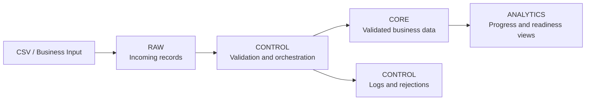
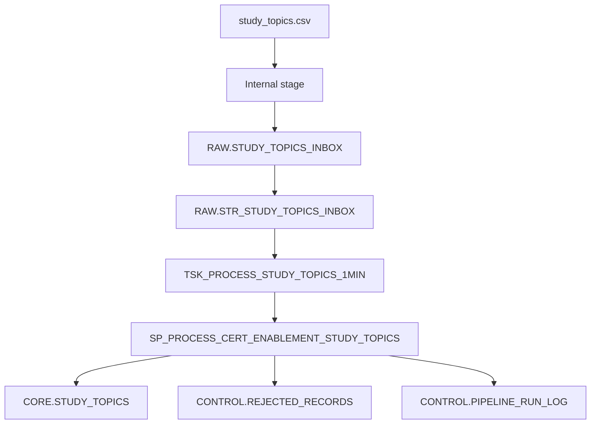
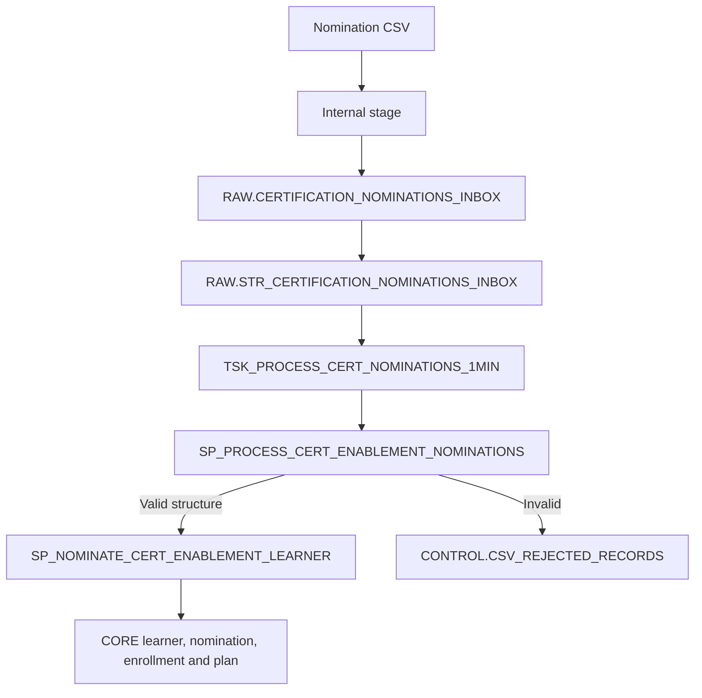
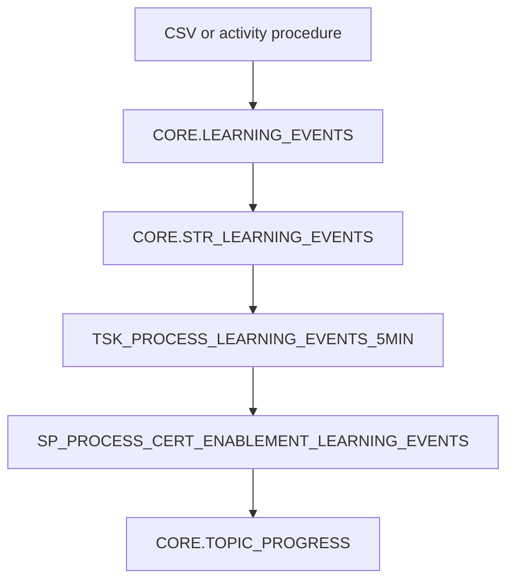

# Platform Architecture and Workflows

## 1. Purpose

The Snowflake Certification Enablement Platform manages an employee's certification journey, including nomination, learning-plan generation, progress tracking, readiness reporting and reminders.

The current implementation supports SnowPro Core COF-C03 as the initial certification.

## 2. Environment

| Object | Name |
|---|---|
| Warehouse | `WH_CERT_ENABLEMENT_DEV_XS` |
| Database | `DB_CERT_ENABLEMENT_DEV` |
| Initial certification | SnowPro Core COF-C03 |

## 3. Schema Architecture

| Schema | Responsibility |
|---|---|
| `RAW` | Incoming records before business validation |
| `CORE` | Validated business entities and transactional records |
| `CONTROL` | Procedures, Tasks, configuration, run logs and rejected records |
| `ANALYTICS` | Reporting views and calculated measures |

## 4. Study-Topic Ingestion

The procedure validates topic ID, domain ID, domain existence, topic name, difficulty level, estimated hours and topic order. Valid records are merged into CORE; invalid records are stored with a rejection reason.

## 5. Certification-Nomination Workflow

The pipeline procedure standardizes and validates the incoming record. The business procedure then resolves the Pod and certification, creates or updates the business records, generates the learner-specific plan and initializes topic progress.

The nomination Task is currently created in a suspended state for controlled testing.

## 6. Learning-Progress Workflow

Progress can currently enter through a progress CSV or the controlled learning-activity procedure.

The event-processing procedure updates hours spent, completion percentage, progress status, start time, completion time and last-activity time.

## 7. Analytics

The current analytics layer contains:

- `ANALYTICS.VW_WEEKLY_STUDY_PLAN`
- `ANALYTICS.VW_LEARNER_PROGRESS`
- `ANALYTICS.VW_DOMAIN_PROGRESS`
- `ANALYTICS.VW_CERTIFICATION_READINESS`
- `ANALYTICS.VW_WEEKLY_REMINDER_CANDIDATES`

### Known design gap

The original analytics views join through `PATH_ID` and `PATH_TOPIC_PLAN`. The newer dynamic nomination workflow stores its schedule in `LEARNER_TOPIC_PLAN` and may leave `PATH_ID` null. Dynamic learners may therefore be missing or incomplete in the existing analytics output.

The analytics layer must be aligned with the approved unified plan model after the data-model review.

## 8. Reminder Workflow

The reminder workflow identifies eligible inactive learners and prepares notifications for both the learner and Pod Lead.

Live email is disabled by default. Simulation mode records reminder attempts without sending email.

## 9. Current Technology Decisions

- X-Small warehouse with auto-suspend and auto-resume
- Internal stages and CSV file formats for current ingestion
- Streams for change detection
- Tasks for scheduled orchestration
- SQL stored procedures for validation and multi-table business processing
- Views for analytics and readiness reporting
- Git and Markdown for source-controlled documentation

Dynamic Tables will be evaluated only where they provide a suitable declarative replacement. They do not automatically replace procedures that perform validation, rejection handling and multi-table transactional writes.

