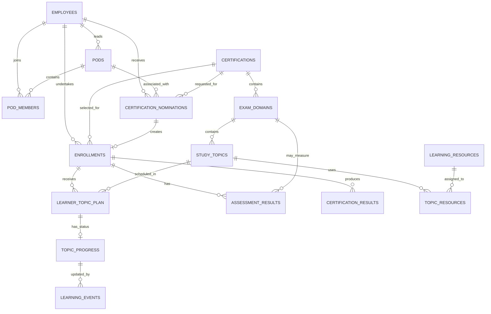

# Snowflake Certification Enablement Platform

## Proposed Data Model

**Document status:** Draft for architecture review  
**Target release:** Version 1.0 foundation  
**Scope:** Logical CORE business model with supporting RAW and CONTROL objects  
**Naming note:** Final physical names are subject to the organizational naming-standard review.

---

## 1. Purpose

This data model supports an employee's certification journey from nomination through learning-plan generation, progress tracking, assessment and certification completion.

The model is designed to answer the following questions:

- Which employee is preparing for which certification?
- Which domains and topics belong to that certification?
- Which topics are assigned to the employee?
- What is the employee's current progress?
- Who nominated the employee and from which Pod?
- What practice assessments has the employee completed?
- Has the employee passed the official certification exam?
- When does an awarded certification expire?

---

## 2. Design Principles

1. Store each business entity in its own table.
2. Avoid repeating employee, certification, topic and resource information.
3. Connect tables using stable internal identifiers.
4. Keep employee master data separate from certification-journey data.
5. Keep planned learning activity separate from actual progress.
6. Keep practice assessments separate from official certification results.
7. Make the design expandable to additional certifications and providers.
8. Preserve historical information such as the original nominator and exam attempts.
9. Keep incoming unvalidated data in RAW and validated business data in CORE.
10. Keep pipeline configuration, rejection records and execution logs in CONTROL.

---

## 3. Schema Responsibilities

| Schema | Responsibility |
|---|---|
| `RAW` | Stores incoming records before business validation |
| `CORE` | Stores validated and standardized business data |
| `CONTROL` | Stores procedures, Tasks, configuration, rejection records and processing logs |
| `ANALYTICS` | Contains reporting and derived-measure views |

---

## 4. Complete CORE Logical Model



---

## 5. CORE Table Catalogue

### 5.1 Employees

**Logical entity:** `EMPLOYEES`  
**Current physical table:** `CORE.LEARNERS`

Stores each employee once, including employees acting as learners and Pod Leads.

| Column | Key | Purpose |
|---|---|---|
| `EMPLOYEE_ID` | PK | Company employee identifier |
| `EMPLOYEE_NAME` | | Employee name |
| `EMAIL` | UQ | Employee email |
| `DEPARTMENT_NAME` | | Department |
| `CURRENT_TITLE` | | Current job title |
| `SNOWFLAKE_EXPERIENCE_YEARS` | | Experience information; not the primary plan driver |
| `ACTIVE_FLAG` | | Active employee indicator |
| `CREATED_AT` | | Creation timestamp |
| `UPDATED_AT` | | Last update timestamp |

Employee information must not be repeated in nomination, enrollment, plan or progress tables.

### 5.2 Pods

**Table:** `CORE.PODS`

Stores each organizational Pod once.

| Column | Key | Purpose |
|---|---|---|
| `POD_ID` | PK | Pod identifier |
| `POD_NAME` | UQ | Business-friendly Pod name |
| `POD_LEAD_EMPLOYEE_ID` | FK | Current authorized Pod Lead; references `EMPLOYEES` |
| `ACTIVE_FLAG` | | Active Pod indicator |
| `CREATED_AT` | | Creation timestamp |
| `UPDATED_AT` | | Last update timestamp |

Pod Lead name and email are obtained from `EMPLOYEES` and should not be repeated in `PODS`.

### 5.3 Pod Members

**Table:** `CORE.POD_MEMBERS`

Connects employees to Pods.

| Column | Key | Purpose |
|---|---|---|
| `POD_ID` | PK, FK | References `PODS` |
| `EMPLOYEE_ID` | PK, FK | References `EMPLOYEES` |
| `JOINED_AT` | | Membership start |
| `LEFT_AT` | | Membership end, when applicable |
| `ACTIVE_FLAG` | | Active membership indicator |
| `UPDATED_AT` | | Last update timestamp |

The composite primary key is `(POD_ID, EMPLOYEE_ID)`.

### 5.4 Certifications

**Table:** `CORE.CERTIFICATIONS`

Stores supported certification definitions.

| Column | Key | Purpose |
|---|---|---|
| `CERTIFICATION_ID` | PK | Stable internal identifier |
| `CERTIFICATION_PROVIDER` | | Snowflake, Microsoft, Google or another provider |
| `CERTIFICATION_CODE` | | Official code such as `COF-C03` |
| `CERTIFICATION_NAME` | | Certification name |
| `EXAM_VERSION` | | Exam version |
| `DESCRIPTION` | | Certification description |
| `VALID_FROM` | | Version validity start |
| `VALID_TO` | | Version validity end; null while current |
| `ACTIVE_FLAG` | | Current active status |
| `CREATED_AT` | | Creation timestamp |
| `UPDATED_AT` | | Last update timestamp |

The internal identifier remains stable even when an official certification code changes.

### 5.5 Exam Domains

**Table:** `CORE.EXAM_DOMAINS`

Stores exam domains under each certification.

| Column | Key | Purpose |
|---|---|---|
| `DOMAIN_ID` | PK | Domain identifier |
| `CERTIFICATION_ID` | FK | References `CERTIFICATIONS` |
| `DOMAIN_NAME` | | Domain name |
| `EXAM_WEIGHT_PERCENT` | | Official exam-domain weight |
| `DOMAIN_ORDER` | | Display and learning order |
| `DESCRIPTION` | | Domain description |
| `VALID_FROM` | | Domain validity start |
| `VALID_TO` | | Domain validity end |
| `ACTIVE_FLAG` | | Current active status |

One certification can contain many exam domains.

### 5.6 Study Topics

**Table:** `CORE.STUDY_TOPICS`

Stores topics under each exam domain.

| Column | Key | Purpose |
|---|---|---|
| `TOPIC_ID` | PK | Topic identifier |
| `DOMAIN_ID` | FK | References `EXAM_DOMAINS` |
| `TOPIC_NAME` | | Topic name |
| `TOPIC_DESCRIPTION` | | Topic description |
| `DIFFICULTY_LEVEL` | | Beginner, intermediate or advanced |
| `ESTIMATED_HOURS` | | Current estimated study effort |
| `TOPIC_ORDER` | | Order within the domain |
| `VALID_FROM` | | Topic validity start |
| `VALID_TO` | | Topic validity end; null while current |
| `ACTIVE_FLAG` | | Current active status |

A topic is related to a certification through its domain:

```text
STUDY_TOPICS.DOMAIN_ID
        → EXAM_DOMAINS.DOMAIN_ID
        → EXAM_DOMAINS.CERTIFICATION_ID
        → CERTIFICATIONS.CERTIFICATION_ID
```

`CERTIFICATION_ID` is not repeated in `STUDY_TOPICS` because the domain already identifies the certification.

### 5.7 Certification Nominations

**Table:** `CORE.CERTIFICATION_NOMINATIONS`

Stores a Pod Lead's request to nominate an employee for a certification.

| Column | Key | Purpose |
|---|---|---|
| `NOMINATION_ID` | PK | Nomination identifier |
| `EMPLOYEE_ID` | FK | Employee being nominated |
| `POD_ID` | FK | Associated Pod |
| `NOMINATED_BY_EMPLOYEE_ID` | FK | Employee who submitted the nomination |
| `CERTIFICATION_ID` | FK | Requested certification |
| `NOMINATION_DATE` | | Nomination date |
| `REQUESTED_TARGET_COMPLETION_DATE` | | Date requested by the Pod Lead |
| `NOMINATION_REASON` | | Business reason |
| `NOMINATION_STATUS` | | Pending, approved, rejected or cancelled |
| `REJECTION_REASON` | | Rejection explanation, when applicable |
| `CREATED_AT` | | Creation timestamp |
| `UPDATED_AT` | | Last update timestamp |

`NOMINATED_BY_EMPLOYEE_ID` preserves the original nominator even if the Pod Lead changes later.

### 5.8 Enrollments

**Table:** `CORE.ENROLLMENTS`

Connects an employee with a certification and represents one certification journey.

| Column | Key | Purpose |
|---|---|---|
| `ENROLLMENT_ID` | PK | Certification-journey identifier |
| `EMPLOYEE_ID` | FK | References `EMPLOYEES` |
| `CERTIFICATION_ID` | FK | References `CERTIFICATIONS` |
| `NOMINATION_ID` | FK | Source nomination, when applicable |
| `START_DATE` | | Learning-plan start date |
| `TARGET_COMPLETION_DATE` | | Current approved completion target |
| `TARGET_EXAM_DATE` | | Planned exam date |
| `ATTEMPT_TYPE` | | Fresh or renewal |
| `PLAN_TYPE` | | Current plan type |
| `ENROLLMENT_STATUS` | | Active, completed, cancelled or another approved status |
| `CREATED_AT` | | Creation timestamp |
| `UPDATED_AT` | | Last update timestamp |

One employee may have several enrollments, and one certification may have several enrolled employees.

### 5.9 Learner Topic Plan

**Table:** `CORE.LEARNER_TOPIC_PLAN`

Stores the planned schedule for every topic assigned to an enrollment.

| Column | Key | Purpose |
|---|---|---|
| `ENROLLMENT_ID` | PK, FK | References `ENROLLMENTS` |
| `TOPIC_ID` | PK, FK | References `STUDY_TOPICS` |
| `PLANNED_WEEK_NUMBER` | | Assigned week |
| `PLANNED_START_DATE` | | Planned start date |
| `PLANNED_END_DATE` | | Planned completion date |
| `RECOMMENDED_HOURS` | | Current recommended effort |
| `REQUIRED_FLAG` | | Required-topic indicator |
| `CREATED_AT` | | Creation timestamp |
| `UPDATED_AT` | | Last update timestamp |

The composite primary key is `(ENROLLMENT_ID, TOPIC_ID)`.

Version 1.0 uses the existing non-weighted scheduling approach. Topic-weighted scheduling is a roadmap enhancement.

### 5.10 Topic Progress

**Table:** `CORE.TOPIC_PROGRESS`

Stores the latest progress state for each assigned enrollment-topic combination.

| Column | Key | Purpose |
|---|---|---|
| `ENROLLMENT_ID` | PK, FK | References the assigned enrollment-topic |
| `TOPIC_ID` | PK, FK | References the assigned enrollment-topic |
| `PROGRESS_STATUS` | | Not started, in progress or completed |
| `COMPLETION_PERCENT` | | Current completion percentage |
| `HOURS_SPENT` | | Total self-reported hours |
| `STARTED_AT` | | First activity time |
| `COMPLETED_AT` | | Completion time |
| `LAST_ACTIVITY_AT` | | Most recent activity time |
| `UPDATED_AT` | | Last update timestamp |

The composite primary key is `(ENROLLMENT_ID, TOPIC_ID)`.

### 5.11 Learning Events

**Table:** `CORE.LEARNING_EVENTS`

Stores the complete history of individual learning updates.

| Column | Key | Purpose |
|---|---|---|
| `EVENT_ID` | PK | Activity identifier |
| `ENROLLMENT_ID` | FK | Associated enrollment |
| `TOPIC_ID` | FK | Associated topic |
| `EVENT_TYPE` | | Started, studied, progress updated or completed |
| `EVENT_TIMESTAMP` | | Activity time |
| `DURATION_MINUTES` | | Self-reported study duration |
| `COMPLETION_PERCENT` | | Percentage reported by the event |
| `EVENT_SOURCE` | | CSV, procedure or future application |
| `NOTES` | | Optional notes |
| `CREATED_AT` | | Record creation time |

An event is valid only when its `(ENROLLMENT_ID, TOPIC_ID)` combination is assigned in `LEARNER_TOPIC_PLAN`.

### 5.12 Assessment Results

**Table:** `CORE.ASSESSMENT_RESULTS`

Stores practice quizzes, practice tests and mock exams.

| Column | Key | Purpose |
|---|---|---|
| `ASSESSMENT_ID` | PK | Assessment attempt identifier |
| `ENROLLMENT_ID` | FK | Associated enrollment |
| `ASSESSMENT_NAME` | | Assessment name |
| `ASSESSMENT_TYPE` | | Quiz, practice test or mock exam |
| `DOMAIN_ID` | FK | Optional assessed domain |
| `SCORE_PERCENT` | | Score |
| `PASSED_FLAG` | | Internal pass indicator |
| `ATTEMPTED_AT` | | Attempt time |
| `NOTES` | | Optional notes |

Practice assessments contribute to internal readiness calculations but do not prove that an employee is officially certified.

### 5.13 Certification Results — Roadmap

**Proposed table:** `CORE.CERTIFICATION_RESULTS`

Stores official exam attempts and awarded-certification validity.

| Column | Key | Purpose |
|---|---|---|
| `RESULT_ID` | PK | Official result identifier |
| `ENROLLMENT_ID` | FK | Associated enrollment |
| `ATTEMPT_NUMBER` | | Exam attempt number |
| `EXAM_DATE` | | Official exam date |
| `RESULT_STATUS` | | Scheduled, passed, failed or absent |
| `SCORE_PERCENT` | | Official score, if available |
| `CERTIFICATION_DATE` | | Award date |
| `VALID_FROM` | | Credential validity start |
| `VALID_TO` | | Credential expiry date |
| `CREDENTIAL_ID` | | External credential identifier |
| `RESULT_SOURCE` | | Source of result information |

This table is included in the future-ready logical model but is not required for the Version 1.0 implementation.

### 5.14 Learning Resources

**Table:** `CORE.LEARNING_RESOURCES`

Stores each reusable learning resource once.

| Column | Key | Purpose |
|---|---|---|
| `RESOURCE_ID` | PK | Resource identifier |
| `RESOURCE_TITLE` | | Resource title |
| `RESOURCE_TYPE` | | Documentation, video, lab or practice material |
| `RESOURCE_URL` | | Resource location |
| `RESOURCE_PROVIDER` | | Resource provider |
| `IS_OFFICIAL` | | Official-resource indicator |
| `VALID_FROM` | | Validity start |
| `VALID_TO` | | Validity end |
| `ACTIVE_FLAG` | | Current availability |

### 5.15 Topic Resources — Proposed Normalization

**Proposed table:** `CORE.TOPIC_RESOURCES`

Connects reusable resources to study topics.

| Column | Key | Purpose |
|---|---|---|
| `TOPIC_ID` | PK, FK | References `STUDY_TOPICS` |
| `RESOURCE_ID` | PK, FK | References `LEARNING_RESOURCES` |
| `RESOURCE_ORDER` | | Recommended order |
| `REQUIRED_FLAG` | | Required-resource indicator |
| `CREATED_AT` | | Creation timestamp |

The composite primary key is `(TOPIC_ID, RESOURCE_ID)`. This mapping allows one resource to support several topics without repeating its title and URL.

---

## 6. Planned Versus Actual Learning Data

| Table | Meaning |
|---|---|
| `LEARNER_TOPIC_PLAN` | What should happen |
| `TOPIC_PROGRESS` | The employee's current position |
| `LEARNING_EVENTS` | The individual activities that happened |

Example flow:

```text
Employee records an activity
        → LEARNING_EVENTS receives a new row
        → Processing updates TOPIC_PROGRESS
        → Analytics reports the latest status
```

---

## 7. Key Relationship Summary

| Parent | Child | Relationship |
|---|---|---|
| `EMPLOYEES` | `ENROLLMENTS` | One employee can have many certification enrollments |
| `CERTIFICATIONS` | `ENROLLMENTS` | One certification can have many enrolled employees |
| `CERTIFICATIONS` | `EXAM_DOMAINS` | One certification contains many domains |
| `EXAM_DOMAINS` | `STUDY_TOPICS` | One domain contains many topics |
| `ENROLLMENTS` | `LEARNER_TOPIC_PLAN` | One enrollment receives many planned topics |
| `STUDY_TOPICS` | `LEARNER_TOPIC_PLAN` | One topic may appear in many enrollment plans |
| `LEARNER_TOPIC_PLAN` | `TOPIC_PROGRESS` | One assigned topic has one latest progress record |
| `TOPIC_PROGRESS` | `LEARNING_EVENTS` | One enrollment-topic can have many activity events |
| `PODS` | `POD_MEMBERS` | One Pod contains many employees |
| `CERTIFICATION_NOMINATIONS` | `ENROLLMENTS` | One approved nomination may create one enrollment |
| `ENROLLMENTS` | `ASSESSMENT_RESULTS` | One enrollment can have many practice assessments |
| `ENROLLMENTS` | `CERTIFICATION_RESULTS` | One enrollment can have multiple official exam attempts |
| `STUDY_TOPICS` | `TOPIC_RESOURCES` | One topic can use many resources |
| `LEARNING_RESOURCES` | `TOPIC_RESOURCES` | One resource can support many topics |

---

## 8. Current-to-Proposed Mapping

| Current physical table | Proposed logical entity | Version 1.0 decision |
|---|---|---|
| `CORE.LEARNERS` | `EMPLOYEES` | Treat as the employee master; rename only after naming review |
| `CORE.CERTIFICATIONS` | `CERTIFICATIONS` | Retain; propose provider and validity fields |
| `CORE.EXAM_DOMAINS` | `EXAM_DOMAINS` | Retain; propose validity fields |
| `CORE.STUDY_TOPICS` | `STUDY_TOPICS` | Retain; make certification relationship explicit in documentation |
| `CORE.ENROLLMENTS` | `ENROLLMENTS` | Retain as the employee-certification connection |
| `CORE.LEARNER_TOPIC_PLAN` | `LEARNER_TOPIC_PLAN` | Retain for dynamic individual plans |
| `CORE.TOPIC_PROGRESS` | `TOPIC_PROGRESS` | Retain |
| `CORE.LEARNING_EVENTS` | `LEARNING_EVENTS` | Retain |
| `CORE.PODS` | `PODS` | Retain; remove repeated Pod Lead name and email in the proposed design |
| `CORE.POD_MEMBERS` | `POD_MEMBERS` | Retain and standardize the employee reference |
| `CORE.CERTIFICATION_NOMINATIONS` | `CERTIFICATION_NOMINATIONS` | Retain and standardize employee references |
| `CORE.ASSESSMENT_RESULTS` | `ASSESSMENT_RESULTS` | Retain for practice assessments |
| Not currently available | `CERTIFICATION_RESULTS` | Version 1.1 roadmap |
| `CORE.LEARNING_RESOURCES` | `LEARNING_RESOURCES` | Retain as a reusable resource master in the proposed design |
| Not currently available | `TOPIC_RESOURCES` | Proposed normalized resource mapping |

The existing fixed-path tables `EXPERIENCE_LEVELS`, `LEARNING_PATHS` and `PATH_TOPIC_PLAN` remain part of the earlier workflow. Their retirement or continued compatibility must be confirmed during architecture review. They are not used as the primary structure in this proposed dynamic-enrollment model.

---

## 9. Supporting Pipeline Tables

The following objects support ingestion and operations but are not part of the main CORE business ER diagram.

| Schema | Object | Purpose |
|---|---|---|
| `RAW` | `STUDY_TOPICS_INBOX` | Stores incoming topic records before validation |
| `RAW` | `CERTIFICATION_NOMINATIONS_INBOX` | Stores incoming nomination records |
| `RAW` | `LEARNER_INFORMATION_INBOX` | Stores incoming employee information |
| `RAW` | `LEARNER_PROGRESS_INBOX` | Stores incoming progress records |
| `CONTROL` | `CSV_REJECTED_RECORDS` | Stores rejected records and business-readable reasons |
| `CONTROL` | `CSV_PIPELINE_RUN_LOG` | Stores pipeline execution results |
| `CONTROL` | `CSV_PROCESSED_RECORDS` | Tracks accepted source records and prevents duplicate processing |
| `CONTROL` | `REMINDER_CONFIGURATION` | Stores reminder mode, inactivity period and email settings |
| `CONTROL` | `REMINDER_NOTIFICATION_LOG` | Audits simulated, sent and failed reminders |

The simplified movement of data is:

```text
Incoming file → RAW inbox → validation procedure → CORE business tables
                                  ↓
                          CONTROL logs/rejections
```

---

## 10. Version Scope

### Version 1.0 — Current Foundation

- Employee, Pod and Pod-membership records
- Certification, domain and topic reference data
- Certification nominations and enrollments
- Learner-specific topic plans
- Topic progress and learning-event history
- Practice assessments and readiness reporting
- Manual CSV-based ingestion
- Stream, Task and stored-procedure processing
- Existing non-weighted scheduling approach
- Simulated reminder workflow
- Markdown documentation and data-model definition

### Version 1.1 — Planned Enhancements

- Topic effort weightage
- Weighted date allocation
- Recalculation of only incomplete topics after an extension
- Fresh-versus-renewal handling
- Official exam-attempt and certification-result tracking
- Certification expiry monitoring and alerts
- Analytics updates for the approved unified plan model

### Version 2.0 — Future Roadmap

- Streamlit interface for nominations and progress updates
- Approved SharePoint or shared-source ingestion
- Snowpipe or another approved automated-ingestion pattern
- Dynamic Tables suitability assessment
- Multiple certification providers
- Semantic Views for governed analytics definitions
- Recommendation-agent integration
- Partner-level certification targets, if required

---

## 11. Assumptions and Limitations Relevant to the Model

- Employees and Pod Leads have stable company employee identifiers.
- Employee progress, hours and completion percentages are self-reported.
- The platform is a certification tracking system, not a full Learning Management System.
- Learning content is hosted externally; the platform stores links and metadata.
- Pod, Pod Lead and certification reference data are configured before nomination processing.
- Certification, domain and topic records come from approved sources.
- Version 1.0 supports SnowPro Core COF-C03 as the initial certification.
- Version 1.0 does not implement weighted topic scheduling.
- Official exam results are not yet automatically retrieved from a certification provider.
- Snowflake primary-key and foreign-key constraints are informational for standard tables; procedures and validation logic must enforce business rules.

---

## 12. Open Review Decisions

1. Confirm whether the physical employee table should remain `LEARNERS` or be renamed according to the organizational naming standard.
2. Confirm whether the older fixed-path workflow should remain supported.
3. Confirm whether validity columns are required in Version 1.0 implementation or only in the approved logical model.
4. Confirm whether `TOPIC_RESOURCES` should be implemented immediately or retained as a normalization recommendation.
5. Confirm which official certification-result fields are available from approved sources.
6. Confirm whether Dynamic Tables are appropriate for any derived processing; multi-table transactional procedures may still require Streams, Tasks and stored procedures.

---

## 13. Summary

The proposed model separates employees, certifications, topics, nominations, enrollments, plans, progress, assessments and resources into related entities. This reduces repeated data, makes the relationships clear and provides a foundation that can support additional certifications and future features without redesigning the entire platform.
