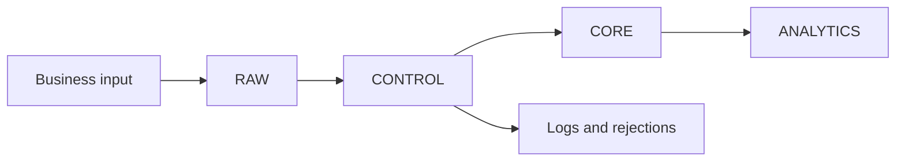
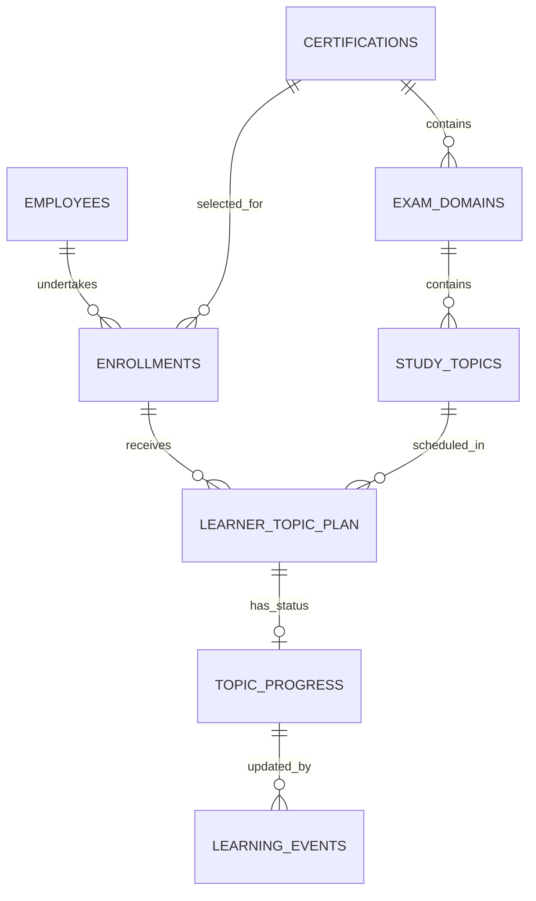

# Friday Show-and-Tell

## Snowflake Certification Enablement Platform

**Presentation objective:** Show what was learned from the architecture review, present the revised foundation and obtain agreement on the next implementation priorities.

This is an architecture-review update, not a claim that every proposed SQL change has already been implemented.

## 1. Current Platform Purpose

The platform manages an employee's certification journey through:

- Pod Lead nomination
- Validation and enrollment
- Learner-specific plan generation
- Topic-progress tracking
- Practice assessment and readiness reporting
- Learner and Pod Lead reminders

The initial certification is SnowPro Core COF-C03.

## 2. Current Architecture



- RAW receives incoming records.
- CONTROL validates and orchestrates processing.
- CORE stores validated business data.
- ANALYTICS reports progress and readiness.

## 3. Architecture-Review Outcome

The broad workflow was accepted. The primary feedback was to make the data foundation clearer, normalized and expandable before adding advanced features.

Key changes in the proposed model:

- Employee details are stored once.
- Certifications are independent of employees.
- Enrollments connect employees to certifications.
- Certification topics are connected through exam domains.
- Learner plans connect enrollments to assigned topics.
- Progress and activity history are separated.
- Practice assessments are separated from official certification results.
- Repeated Pod Lead and resource data are removed in the proposed normalized structure.

## 4. Revised CORE Model



The complete model is documented in `data-model.md`.

## 5. Important Relationship Examples

### Employee to certification

```text
EMPLOYEE → ENROLLMENT ← CERTIFICATION
```

The enrollment stores the start date, target date and status for that employee's certification journey.

### Topic to certification

```text
STUDY TOPIC → EXAM DOMAIN → CERTIFICATION
```

The relationship already exists in the current schema but is now made explicit in the model and documentation.

### Plan and progress

```text
LEARNER_TOPIC_PLAN = What should happen
TOPIC_PROGRESS     = Current position
LEARNING_EVENTS    = What activities happened
```

## 6. Version 1.0 Scope

Version 1.0 focuses on:

- Approved logical data model
- Clear table relationships
- Current nomination and progress pipelines
- Existing non-weighted schedule
- Practice assessment and readiness reporting
- Assumptions and limitations
- Markdown documentation in Git

## 7. Roadmap Separation

### Version 1.1

- Weighted topic scheduling
- Extension recalculation for incomplete topics
- Fresh and renewal handling
- Official exam results and certification expiry
- Unified dynamic-plan analytics

### Version 2.0

- Streamlit interfaces
- Automated SharePoint ingestion
- Dynamic Tables evaluation
- Multiple certification providers
- Semantic Views and recommendation agent

## 8. Assumptions to Highlight

- Progress and hours are self-reported.
- The platform is not a complete LMS.
- Learning resources are hosted externally.
- File upload is currently manual.
- Live reminder email is disabled by default.
- Version 1.0 does not use weighted topic scheduling.

## 9. Known Current Gaps

- Fixed and dynamic plan designs currently coexist.
- Analytics views were originally designed for fixed paths.
- Dynamic learners may not appear correctly until analytics are aligned.
- Official exam results and expiry are not yet operationalized.
- Final physical names require naming-standard review.

## 10. Decisions Requested

1. Should `CORE.LEARNERS` remain the physical employee master, or should it be renamed according to the naming standard?
2. Should the older fixed-path workflow remain supported?
3. Should certification and topic validity fields be implemented in Version 1.0?
4. Should `TOPIC_RESOURCES` be implemented now or retained as a future normalization improvement?
5. Should official certification-result tracking begin in Version 1.1?
6. Which SQL changes should be prioritized after approval?

## 11. Evidence to Open During the Presentation

- `data-model.md` — complete logical model and ER diagram
- `architecture.md` — schema and processing workflows
- `assumptions-and-limitations.md` — scope boundaries
- `roadmap.md` — Version 1.0, 1.1 and 2.0 separation
- `procedure-catalog.md` — responsibilities of procedures and Tasks
- `bhaski-feedback-action-plan.md` — feedback-to-action mapping

## 12. Demo Checklist

- Open the Git repository.
- Open `docs/README.md`.
- Show the four-schema architecture.
- Open the complete ER diagram in `data-model.md`.
- Explain the three main relationship chains.
- Show Version 1.0 versus roadmap scope.
- Show assumptions and known limitations.
- End with the decisions requested from the reviewers.

